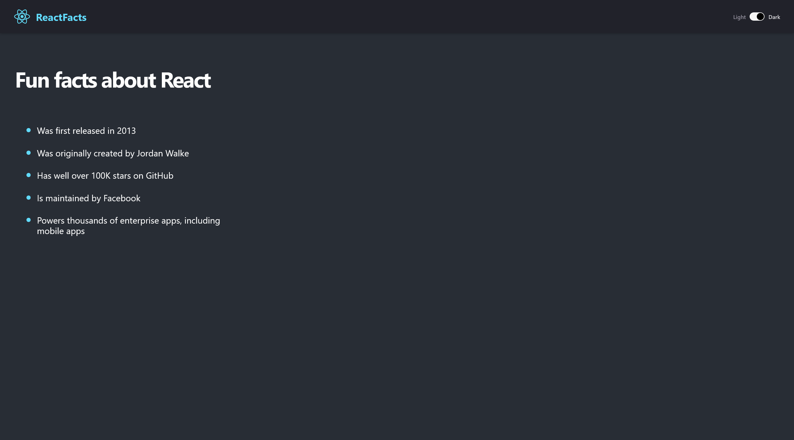

# Toggle - Dark/Light mode

This is a solution to the React Site project on Scrimba. Scrimba helps you improve your coding skills by building realistic projects. Provides user with ability to toggle page between a dark and light mode.

## Table of Contents

    1.Overview
        The Challenge
        Screenshot
        Getting Started with Create React App
    2.My Process
        Built with
    3.Author
    
## Overview
<h3>Challenge - Create a first site using React.JS framework with Darkmode toggle</h3>

Dark-mode

Light-mode

<h3>Getting Started</h3>

This project was bootstrapped with Create React App.
## My Process

<h2>Built with</h2>

*  Semantic HTML5 markup
*  CSS custom properties
*  React.JS
*  Flexbox

## Authors

    LinkedIn - Patrick Pachacz

